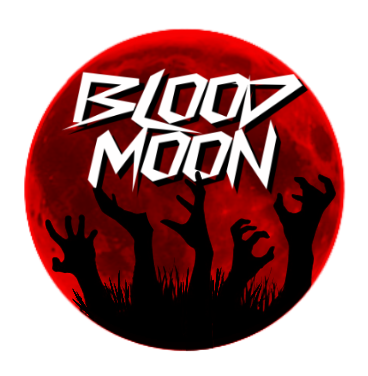

<!-- markdownlint-disable-next-line -->

  

  
  
  

---

## We are Blood Moon Project Zomboid 🌙 🧟

> We are a **multinational group of friends** who put together this Project Zomboid server **for fun**.  
> No corporate backing, no big team—just us building something we enjoy.

We are **2 senior backend developers**, **1 sysadmin & senior DevOps**, and **3 Game Masters (GMs)**. Together we are creating a **custom PvP server** for Project Zomboid with **custom mods** and a lot of **enthusiasm**. If you stumble upon our org or our server, welcome.

---

### ⚙️ Behind the scenes

We run **dev**, **staging**, and **production** environments and put real time into keeping everything running and improving.

| Resource | Per month |
| :------- | --------: |
| **Servers** (dev, staging, production) | **$150+** |
| **Senior backend** (2 devs × 8h/day) | **~480 h** |
| **Sysadmin & DevOps** (1 × 8h/day) | **~240 h** |
| **Game Masters** (3 GMs, monitoring & config, >10h/day each) | **900+ h** |

*No investors, no sponsors—just us. We don’t earn money from this; every dollar and hour comes from the team.*

Rough equivalent at current market rates (senior dev/DevOps $70–90/h, GM/ops $20–30/h): **$80k/month**. For reference only.

---

### 💜 Support us

If you’d like to support what we do—servers, development time, or the people keeping things running—you can do so here:

  

  We’re not asking for anything—play, have fun, and if you want to chip in, we appreciate it.

---

  <strong>Everything here is in alpha</strong> and subject to change. All rights reserved.

  <em>Blood Moon Project Zomboid — custom PvP server. Survive, fight, conquer. 🧟</em>

